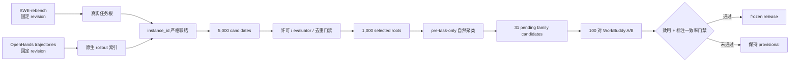
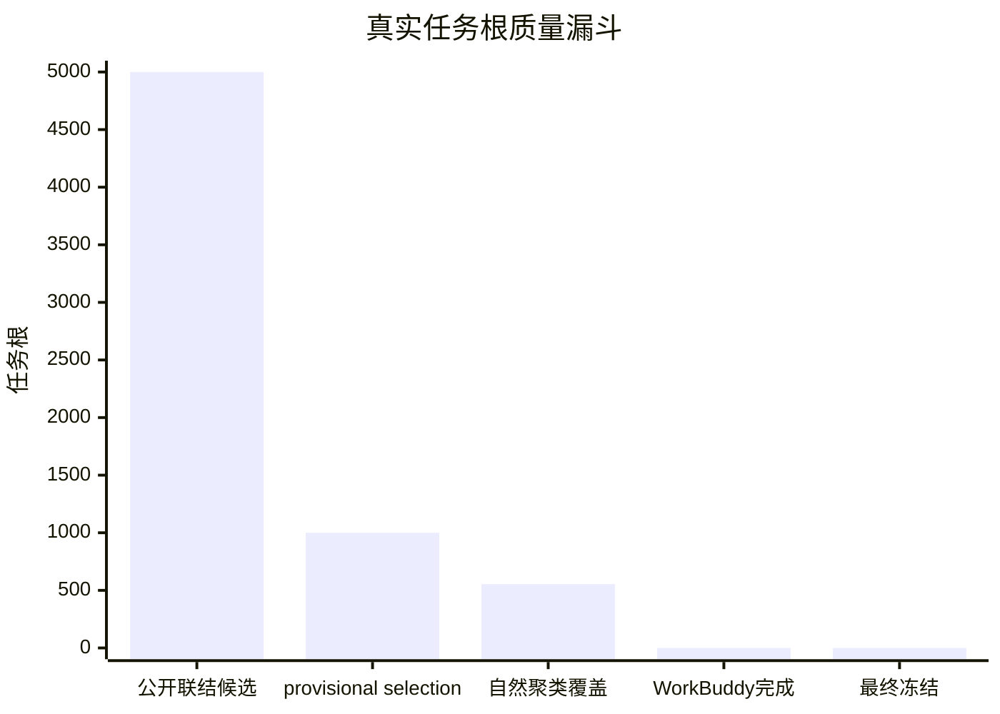

# 原生公开数据驱动的 Skill 评测集：研究与对齐报告

生成日期：2026-08-24
当前状态：**原生数据采集与静态门禁通过；尚未冻结**

## 结论

旧 `trigger-v3` 已通过独立 revert 提交撤销。新链路没有预写 100 个 Skill，也没有生成对话或预填 `create/update/nothing` 比例。本轮从固定 revision 的公开真实任务和原生 OpenHands 轨迹中联结出 **5,000 个候选任务根**，再按仅使用任务开始前字段的确定性规则选出 **1,000 个 provisional roots**。

这 1,000 个任务引用 **10,717 条原生 agent rollout**，覆盖 **91 个仓库**。严格校验结果为 `collection_pass`，近重复对为 0。自然聚类只发现 31 个候选族，而不是为了接近目标强制拆成 100 类。

WorkBuddy A/B 尚未执行：预检状态为 `not_executed`，阻塞项为 `baseline_user_key_present, memory_core_healthy, memory_proxy_healthy, docker_ready`。这些结果不会由 OpenHands 原生结果替代，因此当前仓库不会生成 `frozen-roots.jsonl`。

## 数据血缘

## 数据漏斗

| 阶段 | 数量 | 是否可当最终评测集 |
|---|---:|---|
| 固定 revision 联结候选 | 5,000 | 否 |
| 去重后的 provisional roots | 1,000 | 否，等待真实重放和复核 |
| 自然候选族覆盖 | 554 | 仅用于族发现 |
| 长尾/噪声任务 | 446 | 保留，用于测试“不应提取” |
| 完成 WorkBuddy A/B | 0 / 100 | 否 |
| 最终 frozen roots | 0 | 尚未发布 |

## 来源判断

| 来源 | 实际用途 | revision / 许可 | 决策 |
|---|---|---|---|
| [nebius/SWE-rebench](https://huggingface.co/datasets/nebius/SWE-rebench) | 当前真实任务根 | `89cdfbab4ab1bd8f5a658bb212d1b63624f4f881` / CC-BY-4.0 | 启用；与轨迹 ID 可严格联结 |
| [OpenHands SWE-rebench trajectories](https://huggingface.co/datasets/nebius/SWE-rebench-openhands-trajectories) | 原生成功、失败和混合轨迹 | `35455389ab51bf5e2306bfd436ef72d0f98bf882` / CC-BY-4.0 | 启用 |
| [SWE-rebench V2](https://huggingface.co/datasets/PrimeIntellect/SWE-rebench-V2) | 后续候选扩充 | `8851474cc41be8bce981362d1363d9f92e247b4b` / CC-BY-4.0 | 暂不联结；现有轨迹 release 与 V2 ID 不兼容 |
| [SWE-Gym](https://github.com/SWE-Gym/SWE-Gym) | 高密度同仓库扩充 | 代码与底层仓库许可分开登记 | 已注册，未混入本轮 1,000 条 |
| [OpenHands Feedback](https://huggingface.co/datasets/OpenHands/openhands-feedback) | 真实用户外部 holdout | MIT | sealed，不参与聚类和调参 |
| [Microsoft AIOpsLab](https://github.com/microsoft/AIOpsLab) | 运维真实运行框架 | MIT | 已注册，待独立运行 |
| [Cloud-OpsBench](https://github.com/LLM4Ops/Cloud-OpsBench) | 潜在运维 benchmark | 当前无明确许可 | `license_blocked`，不下载、不再分发 |
| [SWE-Lancer](https://openai.com/index/swe-lancer/) | 外部真实任务泛化 | 单独核验资产许可 | sealed，不参与族发现 |

## 分布

- 原生结果：成功 310、失败 421、成功与失败 rollout 并存 269。
- 时间切分：discovery 234、development 90、lifecycle test 154、整族 zero-shot 76、未聚类长尾 446。
- 许可证：MIT License=460; Apache License 2.0=245; BSD 3-Clause "New" or "Revised" License=188; BSD 2-Clause "Simplified" License=44; BSD License=29; BSD 3-Clause=12; BSD=11; New BSD License=11。

## 自然候选 Skill 族

下表是由问题陈述聚类得到的证据候选，不是最终 Skill 名称或金标。所有候选都必须经过可复用工作流复核和 WorkBuddy 配对效用验证。

| 候选族 | 根数 | 仓库数 | 任务开始前高权重词 | 状态 |
|---|---:|---:|---|---|
| `natural-029-02a20d3ee4c8` | 50 | 21 | py line, line, py, file, lib | `pending_utility_review` |
| `natural-013-1e4d17481765` | 46 | 10 | dvc, bleach, foo, sc, plot | `pending_utility_review` |
| `natural-023-7c3121bf59f7` | 31 | 3 | select, sql, table, tab_a, sqlglot | `pending_utility_review` |
| `natural-019-e78503f5c2ee` | 30 | 11 | responses, headers, response, content, requests | `pending_utility_review` |
| `natural-027-2919602e275a` | 28 | 4 | dataclass, serde, foo, type, schema | `pending_utility_review` |
| `natural-028-c73a49d3e1dd` | 23 | 4 | zarr, fsspec, path, file, version | `pending_utility_review` |
| `natural-010-6835bac39e4a` | 19 | 5 | storage, google, cloud, cloud storage, bucket | `pending_utility_review` |
| `natural-001-d991d5ac5414` | 18 | 7 | disable, command, commands, option, reframe | `pending_utility_review` |
| `natural-014-f787377dd420` | 18 | 3 | markdown, md, block, list, item | `pending_utility_review` |
| `natural-017-c44f11236dd8` | 18 | 15 | support, version support, version, doesn, ssl | `pending_utility_review` |
| `natural-020-02d87d9028ad` | 18 | 2 | charm, charmcraft, setuptools_scm, version, py | `pending_utility_review` |
| `natural-000-51489cc8dd3c` | 17 | 4 | nx, networkx, graph, minimizers, cost | `pending_utility_review` |
| `natural-018-8543035b21ce` | 17 | 6 | datetime, sentry, canvasapi, canvas, timezone | `pending_utility_review` |
| `natural-022-41f7d9067153` | 16 | 8 | request related, related problem, solution like, feature request, request | `pending_utility_review` |
| `natural-005-ed751c105abe` | 15 | 5 | briefcase, windows, relative, beeware, software versions | `pending_utility_review` |
| `natural-009-beaf65166760` | 15 | 8 | planet, filter, orders, query, cli | `pending_utility_review` |
| `natural-030-5734f7a38835` | 15 | 2 | pre, pre commit, commit, hooks, cache pre | `pending_utility_review` |
| `natural-003-de69f3f0ff61` | 14 | 8 | gitlab, don, context manager, skip, 308 | `pending_utility_review` |
| `natural-004-27793882df11` | 14 | 2 | qml, pennylane, wires, shape, to_onehot | `pending_utility_review` |
| `natural-026-e1c660b56106` | 13 | 2 | jsonargparse, parser, config, argumentparser, jsonargparse version | `pending_utility_review` |
| `natural-002-2f872d9151c8` | 12 | 1 | streamlink, plugin, stream, guidelines, streamlink url | `pending_utility_review` |
| `natural-016-117576630cf9` | 12 | 2 | numba, njit, nopython, pipeline, reproducer | `pending_utility_review` |
| `natural-007-388e48901446` | 11 | 2 | reana, reana client, workflow, client, cli | `pending_utility_review` |
| `natural-011-231df139c6fa` | 11 | 3 | channel, haystack, pika, called, parameter | `pending_utility_review` |
| `natural-012-164c7851a380` | 11 | 4 | screen, app, abc, class, css | `pending_utility_review` |
| `natural-015-37b0dc2d31bc` | 11 | 1 | jp, background, created jira, _issue jp, _issue | `pending_utility_review` |
| `natural-025-9a8d02ffcfac` | 11 | 1 | xonsh, encoding, encoding utf, false, xonsh version | `pending_utility_review` |
| `natural-006-7e726acbaf11` | 10 | 1 | hy, hy hy, symbol, line, setv | `pending_utility_review` |
| `natural-008-edf95e055bc6` | 10 | 1 | anyio, asyncio, task, await, async | `pending_utility_review` |
| `natural-021-ba6e33e30197` | 10 | 3 | hash sha256, sha256, requirements, hashin, hash | `pending_utility_review` |
| `natural-024-1fcd19cc5bdf` | 10 | 2 | nipype, nipype nipype, interfaces, engine, node | `pending_utility_review` |

## 与 mentor 对齐的决策点

1. 评测单位是独立真实任务根，不是 rollout 或切片；同一任务的所有轨迹永远同 split。
2. Skill 数量由真实重复模式决定。当前结果是 31 个候选族和 446 个长尾任务，不人为补成 100 类。
3. `create/update/nothing` 必须由后续 A/B 效用反推，不能按目标比例构造。
4. 核心指标保持为 pass@1、含蒸馏总 token、turn、提取率、命中率，并额外报告有益命中与负迁移。
5. 发布器是 fail-closed：100 对 WorkBuddy 重放、族级效用复核、边界一致率 ≥95% 和动作 κ ≥0.90 任一缺失都不生成冻结文件。

## 当前限制与下一批实验

- 当前 1,000 条主要是 Python 软件工程任务，不能代表云运维、Windows、网络和事故响应的总体分布。
- OpenHands 轨迹是针对真实 GitHub 任务产生的原生 agent-environment 轨迹，不等同于真实用户聊天；真实用户差异由 sealed holdout 单独测量。
- 本机 WorkBuddy 可执行文件存在，但缺少 baseline user key，MemoryCore/Proxy 未启动且 Docker daemon 未运行；因此没有伪造 A/B 结果。
- 31 个聚类中存在单仓库簇和宽泛词簇，它们可能在效用审查中被拒绝或拆分；当前均未标成 Skill。
