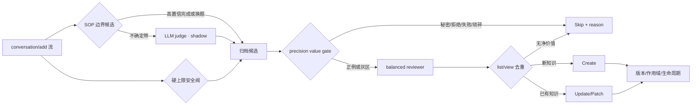

# 与 Mentor 对齐：Skill 提取链路决策稿

## 希望对齐的决策

不是决定“多生成还是少生成”，而是确认三段式治理：**边界候选、价值判断、质量写入**。推荐离线默认候选为 `sop_v1`，价值门为 `precision_v1`，reviewer 为 `balanced_v4`；线上保持 legacy 默认，通过 shadow → 5% canary → 扩量推进。

## 方案图

## 已有证据

| 决策点 | Legacy/朴素方案 | 推荐方案 | 关键结果 |
|---|---|---|---|
| 边界 | 固定 10 工具调用 | sop_v1 + LLM shadow | 固定 10 recall 0；sop_v1 P100/R73.3；LLM P/R93.3 |
| 是否值得提 | 全部交给 reviewer | precision_v1 前置门 | 避免 36.4% reviewer 调用，正例透传 100% |
| 怎么写 | legacy_v2 高召回 prompt | balanced_v4 | 冻结 30-case holdout：F1 85.7 → 100，误提取 33.3% → 0 |
| 成本 | 每轮语义判断、长 prompt | 候选调用 + 短 reviewer | LLM judge 仅 21/79 batch；v4 prompt token 比 legacy 少 57.2% |

外部有效性 smoke test 给出反向证据：6 个真实编码修复任务虽然 6/6 测试通过，但只有 1/6 被日志识别为归档，且没有生成 Skill。因而当前 Go 结论是“允许 shadow”，不是“允许自动写入 canary”；先补 coding-agent 完成表达和真实轨迹标签。

## 建议 Mentor 重点挑战的假设

1. 生产流量中“隐式完成”的占比是否足以覆盖 LLM judge 的新增成本？
2. 误提取的损失函数是否显著高于漏提取？若是，线上阈值应保持 precision-first。
3. 偏好与环境背景应继续作为 Skill，还是拆到独立 memory/rule 类型？本实现先兼容 reviewer，长期建议拆类型。
4. Skill 复用价值用什么窗口衡量：30/60/90 天命中、节省 token、提升成功率，还是人工保留率？
5. 哪些场景允许自动 update，哪些必须人工批准？安全、生产变更和跨团队规则建议强制审批。

## Go / No-Go 门槛

进入 canary 前：边界 precision ≥95%，value-gate unsafe false skip=0，reviewer false extraction ≤5%，全部安全测试通过。扩量前：真实任务 pass@1 不下降，负迁移率 <1%，p95 额外时延满足预算，单位有效复用成本下降，且回滚与审计链路演练通过。任何硬安全负例写入、跨租户污染或生产成功率显著下降都立即回滚。

## 下一阶段交付

- 双人盲标 300+ 真实匿名轨迹，保留冲突与仲裁记录；
- AgentBench/InterCode 容器轨迹的真实执行 holdout；
- grouped temporal evaluation：早期任务产出，后期同族任务检验复用；
- 单模型多 seed + 第二模型复核，报告 bootstrap 区间；
- 生命周期实验：重复合并、过期、回滚、30/60/90 天无命中衰减。
