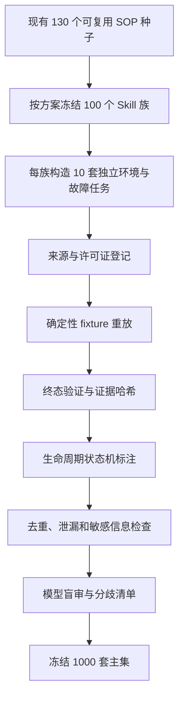

# Trigger v3 数据获取与质量控制方案

## 获取漏斗

## 数据来源配额

每个 SOP 族严格采用 `4 + 3 + 2 + 1` 配额：

- 4 套确定性实验 fixture：在隔离语义下重放诊断、修复、验证，输出带回执哈希。
- 3 套公开参考衍生：根据公开项目的维护模式重新编写，不复制原始 issue 或文档段落。
- 2 套官方文档矩阵：改变平台、版本或部署拓扑，核心安全不变量保持不变。
- 1 套生命周期困难任务：验证新增分支、纠错或回滚强化是否值得更新。

所有记录包含来源 URL、仓库、revision、许可证/使用条款、访问日期、改写声明和证据哈希。若来源无法确认，只能进入候选池，不能进入冻结集。

## 独立性与真实性口径

- 1000 套主集记录具有不同的任务 ID、环境、故障上下文和证据回执，并作为独立 SOP 根统计。
- 同族任务共享需要学习的流程不变量，这是累积 Skill 评测的设计目标，不属于跨族重复。
- 对话前缀、合并消息、确认尾句和遥测噪声属于相关变体，单独存储、单独报告。
- 当前领域输出来自确定性 fixture；不得描述为生产系统实测。后续实机数据应作为独立外部验证集，而不是悄悄替换本版证据等级。

## 标注规则

- 所有任务只有在最终验证成功后才标记 SOP 结束。
- 没有历史 Skill 且流程可复用时标 `create`。
- 历史 Skill 缺少经过执行和回归验证的通用分支时标 `update`。
- 只有参数、平台名称或无关日志变化时标 `nothing`。
- transcript 不包含 `create/update/nothing` 金标，防止模型通过答案泄漏完成盲审。

## 验收与复现

构建器使用固定种子并生成 1000 条主集、4000 条边界观测、100 个最终金标 Skill 和逐条 provenance。确定性验证必须为零错误；模型盲审结果报告边界一致率、动作一致率、Cohen's κ 和全部分歧，不用模型结果覆盖人工定义的金标。
