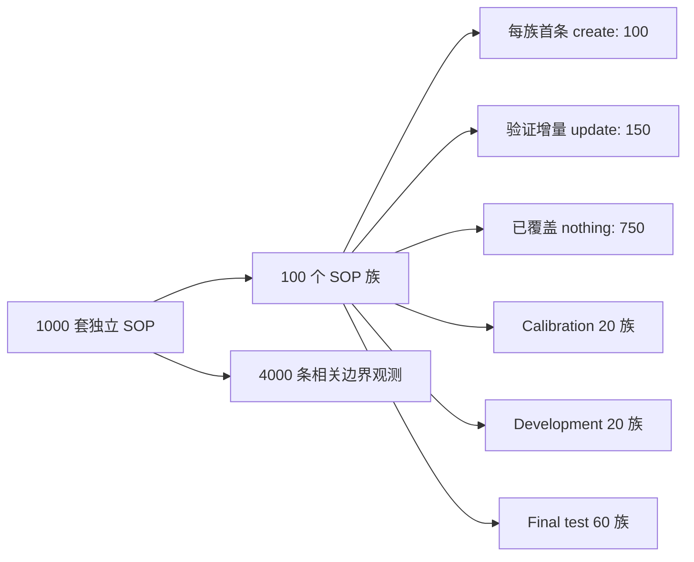

# Trigger v3 数据卡

## 一眼看懂

主集的统计单位是完整独立 SOP，不是把同一对话的扰动重复计数。每个 SOP 在终态触发审查；是否写入由生命周期金标另行决定。

## 分类与预期 Skill

| 大类 | Skill 数 | 预期 Skill ID |
|---|---:|---|
| 容器与编排 (container-orchestration) | 8 | `k8s-crashloop-config`、`helm-atomic-upgrade`、`docker-compose-health`、`k8s-pdb-rollout`、`container-multiarch`、`k8s-hpa-tune`、`k8s-networkpolicy`、`statefulset-volume-expand` |
| CI/CD (ci-cd) | 8 | `actions-cache-poison`、`gitlab-runner-disk`、`jenkins-stuck-agent`、`canary-auto-rollback`、`artifact-signing`、`pipeline-flaky-test`、`db-migration-gate`、`pipeline-secret-scan` |
| 数据库 (databases) | 8 | `postgres-index-plan`、`mysql-replica-lag`、`redis-memory-policy`、`mongo-index-build`、`postgres-pitr`、`mysql-online-schema`、`postgres-vacuum-bloat`、`mysql-backup-restore` |
| 网关、代理与 TLS (web-proxy-tls) | 8 | `nginx-upstream-502`、`envoy-cert-rotation`、`nginx-rate-limit`、`haproxy-drain`、`traefik-acme`、`mtls-client-auth`、`nginx-websocket`、`gateway-cors` |
| 可观测性与故障响应 (observability-incident) | 8 | `prometheus-cardinality`、`grafana-alert-no-data`、`otel-trace-gap`、`loki-ingestion-lag`、`slo-burn-alert`、`incident-timeline`、`blackbox-probe`、`log-redaction` |
| 云基础设施与 IaC (cloud-infra-iac) | 8 | `terraform-drift`、`cloudformation-rollback`、`terraform-state-lock`、`s3-lifecycle`、`iam-least-privilege`、`vpc-route-recovery`、`terraform-module-upgrade`、`managed-db-failover` |
| Linux 与系统服务 (linux-services) | 8 | `systemd-env-recovery`、`disk-inode-cleanup`、`journald-retention`、`ssh-hardening`、`chrony-clock-sync`、`kernel-sysctl`、`logrotate-fix`、`nfs-stale-handle` |
| Windows 运维 (windows-operations) | 7 | `windows-service-recovery`、`iis-cert-binding`、`scheduled-task`、`eventlog-triage`、`win-firewall-rule`、`disk-cleanup-windows`、`windows-update-ring` |
| 数据管道与消息系统 (data-messaging) | 8 | `kafka-consumer-lag`、`flink-checkpoint`、`airflow-backfill`、`spark-skew`、`rabbitmq-queue`、`debezium-offset`、`schema-registry-compat`、`stream-dedup` |
| 应用调试与测试 (application-debugging) | 8 | `node-memory-leak`、`python-deadlock`、`java-gc-pause`、`go-race`、`api-timeout`、`sql-n-plus-one`、`contract-test`、`flaky-clock` |
| 安全与身份 (security-identity) | 7 | `oauth-key-rotation`、`rbac-least-privilege`、`vault-token`、`waf-rule`、`ssh-ca`、`dependency-vuln`、`secret-redaction` |
| 开发工具与发布工程 (developer-tooling) | 7 | `pnpm-lock-repair`、`python-uv-migration`、`precommit-format`、`semver-release`、`git-bisect`、`devcontainer-repair`、`api-client-generation` |
| 网络与边缘设施 (network-edge) | 7 | `bgp-route-leak`、`dnssec-rollover`、`vpn-tunnel`、`loadbalancer-health`、`ipv6-dualstack`、`nat-port-exhaustion`、`dhcp-scope` |

合计 13 个领域、100 个 SOP 族、每族 10 套任务，预期创建 100 个 Skill。

## 生命周期金标

| 动作 | 数量 | 比例 |
|---|---:|---:|
| create | 100 | 10% |
| update | 150 | 15% |
| nothing | 750 | 75% |

每族按顺序评测并维护 Skill 版本。50 个族包含一次更新，50 个族包含两次更新。派生前缀只用于边界鲁棒性，不参与独立样本置信区间。

## 来源构成

每族固定包含 4 套确定性实验 fixture、3 套公开参考衍生、2 套官方文档矩阵和 1 套生命周期困难任务。逐条来源、许可证、改写说明和证据哈希见 `datasets/provenance.jsonl`。

## 重要限制

领域命令输出是可重复的确定性 fixture 观察值，不是生产执行记录。该版本适合先校验边界、去重和 Skill 生命周期；真实基础设施外部有效性需要后续独立实机集验证。
